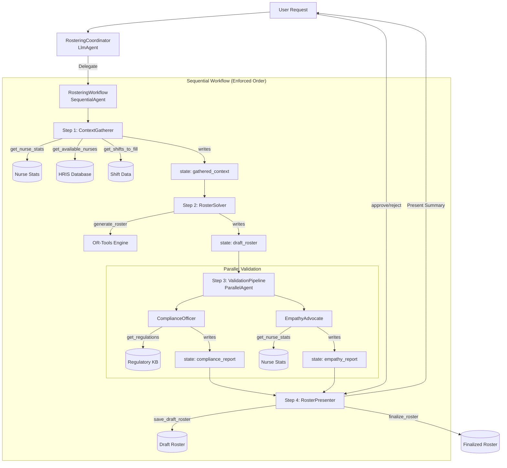
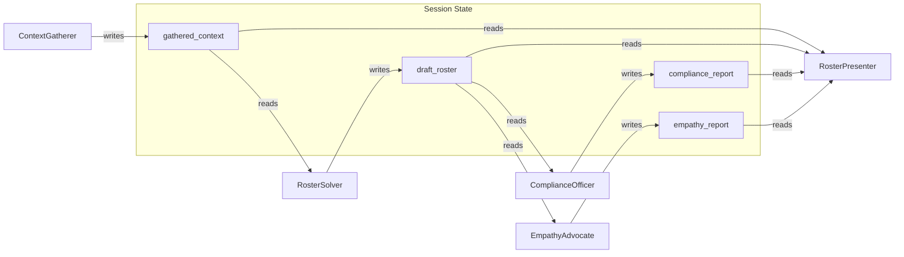

# Nurse Rostering Agent Design

## Goal Description
Design a Nurse Rostering Agent that balances complex scheduling logic (fairness, regulations, certifications) with human empathy (preferences, burnout prevention). The system will be built using the Agent Development Kit (ADK), deployed on Agent Engine, and integrated with Gemini Enterprise.

## User Review Required
> [!IMPORTANT]
> This is a high-level design. Specific regulations and fairness metrics need to be defined by the user.

## Proposed Architecture
The system uses a **SequentialAgent** workflow to enforce mandatory steps, with a **ParallelAgent** for concurrent validation.

### Agent Hierarchy

```
RosteringCoordinator (LlmAgent)
└── RosteringWorkflow (SequentialAgent)
    ├── ContextGatherer (LlmAgent)
    ├── RosterSolver (LlmAgent)
    ├── ValidationPipeline (ParallelAgent)
    │   ├── ComplianceOfficer (LlmAgent)
    │   └── EmpathyAdvocate (LlmAgent)
    └── RosterPresenter (LlmAgent)
```

### Agents

1.  **RosteringCoordinator (LlmAgent)**
    *   **Role**: Entry point for user requests.
    *   **Responsibility**: Delegates roster generation to the SequentialAgent workflow. Handles misc requests like viewing pending rosters.
    *   **Type**: `LlmAgent` with sub-agent delegation.

2.  **RosteringWorkflow (SequentialAgent)**
    *   **Role**: Enforces mandatory workflow steps.
    *   **Responsibility**: Ensures context gathering, solving, validation, and presentation happen in strict order.
    *   **Type**: `SequentialAgent` (no LLM, deterministic flow).

3.  **ContextGatherer (LlmAgent)**
    *   **Role**: Data collection before roster generation.
    *   **Responsibility**: Gathers nurse stats, fatigue scores, available shifts, and regulations.
    *   **Tools**: `get_nurse_stats`, `get_available_nurses`, `get_shifts_to_fill`, `get_regulations`.
    *   **Output**: Writes to `session.state["gathered_context"]`.

4.  **RosterSolver (LlmAgent)**
    *   **Role**: Mathematical optimization of the schedule.
    *   **Responsibility**: Uses **Google OR-Tools** to generate optimal roster based on constraints and fatigue scores.
    *   **Tools**: `generate_roster` (OR-Tools wrapper that auto-loads data).
    *   **Output**: Writes to `session.state["draft_roster"]`.

5.  **ValidationPipeline (ParallelAgent)**
    *   **Role**: Concurrent validation.
    *   **Responsibility**: Runs compliance and empathy checks in parallel for efficiency.
    *   **Type**: `ParallelAgent`.

6.  **ComplianceOfficer (LlmAgent)**
    *   **Role**: Regulatory validation.
    *   **Responsibility**: Validates roster against labor laws, union agreements, and safety mandates.
    *   **Tools**: `get_regulations`.
    *   **Output**: Writes to `session.state["compliance_report"]`.

7.  **EmpathyAdvocate (LlmAgent)**
    *   **Role**: Human-centric review.
    *   **Responsibility**: Evaluates fairness, burnout prevention, and preference satisfaction.
    *   **Tools**: `get_nurse_stats`, `get_nurse_history`.
    *   **Output**: Writes to `session.state["empathy_report"]`.

8.  **RosterPresenter (LlmAgent)**
    *   **Role**: Synthesis and user interaction.
    *   **Responsibility**: Combines all reports, presents to user, handles approval/rejection.
    *   **Tools**: `save_draft_roster`, `finalize_roster`, `reject_roster`.

## Detailed Architecture

### Agent Interactions (SequentialAgent Workflow)



### Session State Flow



### Workflow Steps

1.  **Step 1: Context Gathering** (ContextGatherer)
    *   Fetches nurse profiles, fatigue scores, and shift requirements.
    *   Writes summary to `session.state["gathered_context"]`.
    *   **Must complete before roster generation**.

2.  **Step 2: Roster Generation** (RosterSolver)
    *   Reads context from session state.
    *   Calls `generate_roster()` which uses OR-Tools with fatigue-aware optimization.
    *   Writes roster to `session.state["draft_roster"]`.

3.  **Step 3: Validation** (ValidationPipeline - Parallel)
    *   **ComplianceOfficer**: Validates against regulations, writes to `compliance_report`.
    *   **EmpathyAdvocate**: Reviews fairness and burnout, writes to `empathy_report`.
    *   Both run concurrently for efficiency.

4.  **Step 4: Presentation** (RosterPresenter)
    *   Reads all reports from session state.
    *   Synthesizes into user-friendly summary.
    *   Saves as draft and awaits user approval.
    *   Handles `finalize_roster()` or `reject_roster()` based on user response.

### Data Models

#### Nurse (Enriched)
```json
{
  "id": "nurse_001",
  "name": "Alice",
  "certifications": ["ACLS", "BLS", "ICU"],
  "seniority_level": "Senior",
  "contract_type": "FullTime", 
  "preferences": {
    "avoid_night_shifts": true,
    "preferred_days": ["Monday", "Tuesday"],
    "adhoc_requests": ["Off_2023-10-27_Reason_Recital"]
  },
  "history_summary": {
    "last_shift": "2023-10-27T20:00:00",
    "consecutive_shifts": 2,
    "weekend_shifts_last_month": 3
  }
}
```

#### Shift
```json
{
  "id": "shift_101",
  "ward": "ICU",
  "start_time": "2023-10-30T08:00:00",
  "end_time": "2023-10-30T16:00:00",
  "required_certifications": ["ICU"],
  "min_level": "Senior"
}
```

#### Roster
```json
{
  "id": "roster_week_42",
  "assignments": [
    {
      "nurse_id": "nurse_001",
      "shift_id": "shift_101"
    }
  ],
  "metadata": {
    "generated_at": "2023-10-28T10:00:00",
    "compliance_status": "Pass",
    "empathy_score": 0.85
  }
}
```

## Technology Stack
*   **Framework**: Google ADK (Python)
*   **Dependency Management**: **uv** (using `pyproject.toml`)
*   **Solver**: **Google OR-Tools** (CP-SAT Solver)
*   **LLM**: Gemini 2.5 Pro (Orchestration, Empathy, Constraint Extraction), Gemini 2.5 Flash (for fast iteration/compliance)
*   **Orchestration**: Agent Engine (Production), **ADK Web** (Local Debugging)
*   **Database**: (Mocked for design)

## Project Structure

```text
.
├── agents/
│   ├── __init__.py
│   ├── agent.py             # Entry point - exports root_agent
│   ├── coordinator.py       # RosteringCoordinator + RosteringWorkflow (SequentialAgent)
│   ├── context_gatherer.py  # ContextGatherer (LlmAgent) - Step 1
│   ├── solver_agent.py      # RosterSolver (LlmAgent) - Step 2
│   ├── compliance.py        # ComplianceOfficer (LlmAgent) - Step 3a
│   ├── empathy.py           # EmpathyAdvocate (LlmAgent) - Step 3b
│   └── presenter.py         # RosterPresenter (LlmAgent) - Step 4
├── tools/
│   ├── __init__.py
│   ├── solver_tool.py       # OR-Tools wrapper (generate_roster)
│   ├── data_loader.py       # Tools to fetch HRIS, shifts, regulations
│   └── history_tools.py     # Tools for nurse stats, roster management
├── models/
│   ├── __init__.py
│   └── domain.py            # Pydantic models for Nurse, Shift, Roster
├── data/
│   ├── mock_hris.json       # Mock nurse data
│   ├── nurse_stats.json     # Nurse fatigue/shift statistics
│   ├── shift_history.json   # Historical roster logs
│   ├── rosters/             # Saved roster files
│   └── regulations/         # Regulatory text files
├── main.py                  # Entry point to run the agent
├── pyproject.toml           # Managed by uv
└── uv.lock
```

## Verification Plan
*   **Local Debugging**: Use **ADK Web** to visualize agent interactions and debug the rostering loop trace.
*   **Scenario Testing**: Run the agent against historical data and known difficult scheduling scenarios.
*   **Metric Evaluation**: Measure rosters against fairness metrics (variance in shifts), compliance rate, and preference satisfaction score.
